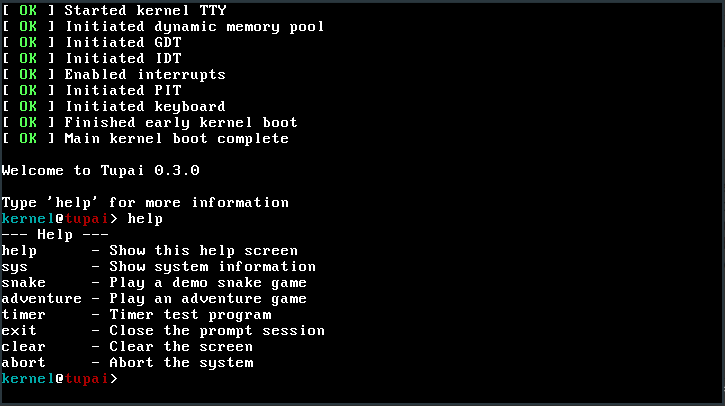

# Tupai

Copyright 2016-2017

---

A simple monolithic operating system created for educational purposes.

## What is Tupai?
---

Tupai is a monolithic operating system kernel. It is currently designed, implemented and maintained by myself, Joshua Barretto. Tupai does not aim for compliance with any particular standard, although borrows many ideas and paradigms from Linux, Unix and POSIX. Tupai is a personal venture into operating system development and is intended as a project to teach myself more about the field. However, I tend to adhere to a rather strict coding convention and style, so the code may be useful to others wishing to learn from it.

## Projects Goals
---

* Monolithic, multi-threaded kernel
* Generic, cross-platform design
* Implementation on at least i386-compatible machines, with a view to later implement on x86_64 and ARM platforms
* Correct use of memory-protection systems such as paging and segmentation
* Interrupt-driven architecture
* Preemptive, multi-tasked userland
* VFS-based filesystem
* File and stream based IPC and process I/O

## Project Status
---

_See `docs/STATUS.md`_

## Building
---

It is recommended that Tupai is built on a UNIX-like system. All other operating systems are untested.

_See `docs/BUILDING.md`_

## Licensing
---

Tupai is currently licensed under GNU General Public License version 3 and is copyrighted 2016-2017.

_See `docs/LICENSE` or [GNU General Public License version 3](https://www.gnu.org/licenses/gpl-3.0.html)_

## Contributors
---

* Programming
	* Joshua Barretto (joshua.s.barretto@gmail.com)

* Guidance and Advice
	* Numerous members of the #osdev Freenode IRC channel (irc.freenode.net)
	* Numerous members of the OSDev Forums (forum.osdev.org)
		* sortie
		* thePowersGang
		* doug16k

* Resources
	* The OSDev Wiki (wiki.osdev.org)
	* Operating System Concepts, Sixth Edition (Silberschatz, Galvin, Gagne))
