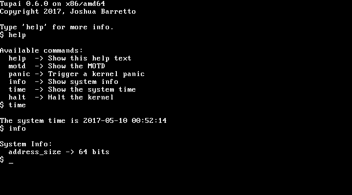

```
██████████████████████████████████████████████████████████████████████████
██░░░░░░░░░░░░░░█░░░░░░██░░░░░░█░░░░░░░░░░░░░░█░░░░░░░░░░░░░░█░░░░░░░░░░██
██░░▄▀▄▀▄▀▄▀▄▀░░█░░▄▀░░██░░▄▀░░█░░▄▀▄▀▄▀▄▀▄▀░░█░░▄▀▄▀▄▀▄▀▄▀░░█░░▄▀▄▀▄▀░░██
██░░░░░░▄▀░░░░░░█░░▄▀░░██░░▄▀░░█░░▄▀░░░░░░▄▀░░█░░▄▀░░░░░░▄▀░░█░░░░▄▀░░░░██
██████░░▄▀░░█████░░▄▀░░██░░▄▀░░█░░▄▀░░██░░▄▀░░█░░▄▀░░██░░▄▀░░███░░▄▀░░████
██████░░▄▀░░█████░░▄▀░░██░░▄▀░░█░░▄▀░░░░░░▄▀░░█░░▄▀░░░░░░▄▀░░███░░▄▀░░████
██████░░▄▀░░█████░░▄▀░░██░░▄▀░░█░░▄▀▄▀▄▀▄▀▄▀░░█░░▄▀▄▀▄▀▄▀▄▀░░███░░▄▀░░████
██████░░▄▀░░█████░░▄▀░░██░░▄▀░░█░░▄▀░░░░░░░░░░█░░▄▀░░░░░░▄▀░░███░░▄▀░░████
██████░░▄▀░░█████░░▄▀░░██░░▄▀░░█░░▄▀░░█████████░░▄▀░░██░░▄▀░░███░░▄▀░░████
██████░░▄▀░░█████░░▄▀░░░░░░▄▀░░█░░▄▀░░█████████░░▄▀░░██░░▄▀░░█░░░░▄▀░░░░██
██████░░▄▀░░█████░░▄▀▄▀▄▀▄▀▄▀░░█░░▄▀░░█████████░░▄▀░░██░░▄▀░░█░░▄▀▄▀▄▀░░██
██████░░░░░░█████░░░░░░░░░░░░░░█░░░░░░█████████░░░░░░██░░░░░░█░░░░░░░░░░██
██████████████████████████████████████████████████████████████████████████
```

Copyright 2016-2017, Joshua Barretto

---

A modular POSIX-like operating system created for educational purposes





## What is Tupai?
---

Tupai is a modular operating system kernel. It is designed, implemented and
maintained by myself, Joshua Barretto. Tupai does not aim for compliance with
any particular standard, although borrows many ideas and paradigms from Linux,
Minix and POSIX. Tupai is a personal venture into operating system development
and is intended as a project to teach myself more about the field. That said, I
tend to adhere to a rather strict coding convention and style, so the code may
be beneficial to others wishing to learn from it.

## Projects Goals
---

* Modular multi-tasking kernel
* Ports for amd64, i386 and ARM (Raspberry Pi 2) architectures
* Generic, cross-platform design that makes future porting relatively trivial
* Correct use of memory-protection systems such as paging / MMUs
* Interrupt-driven architecture
* Preemptive, multi-process POSIX-like userland
* Simple filesystem

## Project Status
---

_See `docs/STATUS.md`_

## Building
---

It is recommended that Tupai is built on a UNIX-like system. All other operating
systems are untested. The build system is dependant on basic UNIX utilities like
'cp', 'mkdir' and 'tar' and also a cross-compiling version of the GNU Compiler
Collection, so this may somewhat limit the range of operating system hosts
capable of building Tupai. My own build system is an x86_64 Arch Linux machine.

_See `docs/BUILDING.md`_

## Licensing
---

Tupai is currently licensed under the ISC license and is copyrighted 2016-2017.

```
Copyright (c) 2017 Joshua Barretto <joshua.s.barretto@gmail.com>

Permission to use, copy, modify, and distribute this software for any
purpose with or without fee is hereby granted, provided that the above
copyright notice and this permission notice appear in all copies.

THE SOFTWARE IS PROVIDED "AS IS" AND THE AUTHOR DISCLAIMS ALL WARRANTIES
WITH REGARD TO THIS SOFTWARE INCLUDING ALL IMPLIED WARRANTIES OF
MERCHANTABILITY AND FITNESS. IN NO EVENT SHALL THE AUTHOR BE LIABLE FOR
ANY SPECIAL, DIRECT, INDIRECT, OR CONSEQUENTIAL DAMAGES OR ANY DAMAGES
WHATSOEVER RESULTING FROM LOSS OF USE, DATA OR PROFITS, WHETHER IN AN
ACTION OF CONTRACT, NEGLIGENCE OR OTHER TORTIOUS ACTION, ARISING OUT OF
OR IN CONNECTION WITH THE USE OR PERFORMANCE OF THIS SOFTWARE.
```

## Contributors
---

* Programming
	* Joshua Barretto (joshua.s.barretto@gmail.com)

* Guidance and Advice
	* Numerous members of the #osdev Freenode IRC channel (irc.freenode.net)
	* Numerous members of the OSDev Forums (forum.osdev.org)
		* sortie
		* thePowersGang
		* doug16k

* Resources
	* The OSDev Wiki (wiki.osdev.org)
	* Operating System Concepts, Sixth Edition (Silberschatz, Galvin, Gagne)
